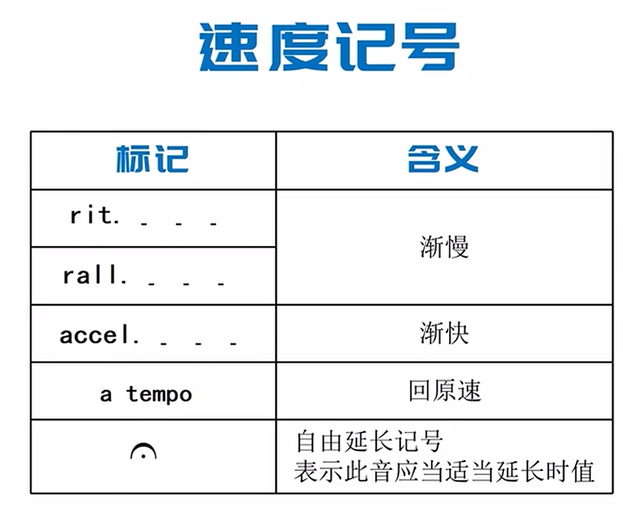
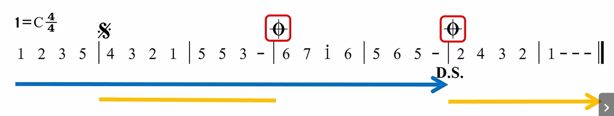
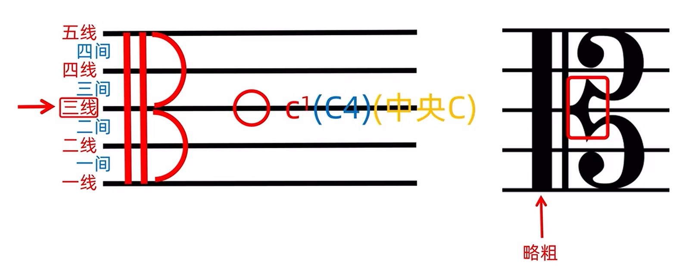
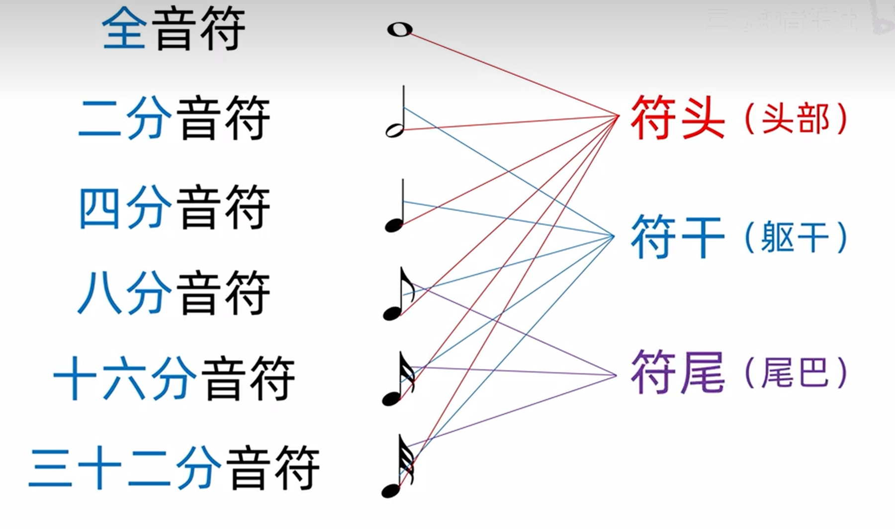
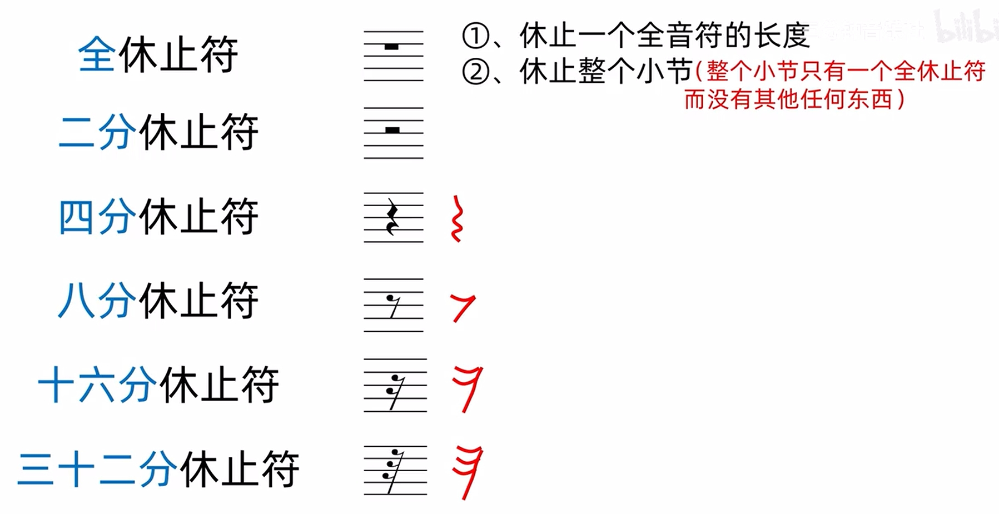

# note_MusicThreory

# 调号 (6-23)

||||
|:-|:-|:-|
|纯八度|两个频率比为1:2的音，构成一个纯八度(范围)|频率比为1:2时，人耳感觉二者及其相似|
|音域|音的范围,最低音和最高音|钢琴的音域为A0到C8(科学音调记号法)|
|||人的音域多为G3到D5|
|||故而1234567多表示C4D4..B4(小字4组)|
|半音|钢琴键相邻键的**距离**||
|全音|半音*2||
|乐音|单一稳定频率的音||
|噪音|频率杂乱不稳定的音||
||音乐是乐音与噪音的组合||
|乐音体系|音乐中使用的乐音集合||
|调式|若干个音，按某种规则排列起来||
|自然大调式|7个音，各音间距为全全半全全全半||
||简称|自然大调|
|||大调|
|C大调|以C起始的自然大调式|`1 = C`|
|音阶|调试中的音，主音开始主音结束，以阶梯状排列|上/下行音阶|
||||

## 音的分组

**中央C**

**标准音**

> 赫尔姆霍音调记号法

> 科学音调记号法

> 半音 和 全音

半音：钢琴键相邻键的**距离**

全音: 半音*2

# 节拍

附点，将前一个音的时长延长一般

# 速度

BPM Beats Per Minete

# 节拍

# 其他标记

>  力度标记

> 速度

> 反复

> 省略

在小节内，重复一个小节

在小节线上重复两个小节

> 演奏记号

2 3 5 同时发音

**琶音** ： 2 3 5 瞬时接力

> 装饰音

上波音的升降符在波音符上方

上波音的升降符在波音符下方

回音符上方的升降符影响上助音

下方的升降符符影响下助音

颤音: 与 上辅音 颤动

倚音: 尽快发音后继续

# 五线谱

## 谱号

## 拍号

四四拍和四二拍的特殊写法

## 音符

## 调号

